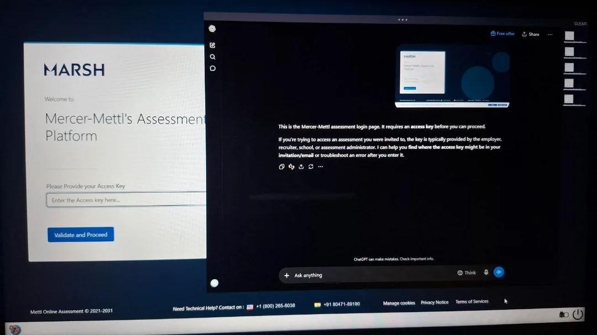

# Ultralay (`quicksearch.exe`)

<p align="center">
   
</p>

A native C++ Windows overlay browser (CEF, off-screen rendering) presented as a
click-through layered topmost window, with a capture-affinity stripper that
lets screenshots capture windows other apps marked `WDA_EXCLUDEFROMCAPTURE`.

- App name: **Ultralay**
- Main exe: **`quicksearch.exe`** (Task Manager shows `quicksearch.exe` +
  `qshelper.exe` — no chrome/edge branding)
- Helper: `qshelper.exe` (all CEF renderer/utility subprocesses)
- Loader DLL: `AffHook.dll` (+ optional `AffManaged.dll`)
- Shortcuts: `Alt+`` hide/show · `Ctrl+Alt+S` screenshot · `Ctrl+Alt+Q` quit
- Single-instance: launching again kills leftover instances first (handoff
  children exempt). No auto-relaunch after the target closes.

## Folder layout (portable + source in one)

```
  portable/              # the app: run portable\quicksearch.exe (keep all
    quicksearch.exe      #   files in portable\ together — exe needs the
    qshelper.exe         #   DLLs + CEF runtime next to it)
    AffHook.dll / AffManaged.dll
    libcef.dll, *.pak, locales/
  README.md
  build.bat              # rebuild everything from src\ into portable\
  src/                   # full source: main.cpp, subproc.cpp, affhook.cpp, affmanaged.cs
  sdk/cef/               # CEF SDK (headers + libcef.lib + Resources)
  thirdparty/            # libcef_dll_wrapper.lib (prebuilt, path-scrubbed)
```

## Run (portable)

No install, no setup. Run `portable\quicksearch.exe` **as admin**:

- Start the target app first, wait for its main window (~3 s), then run the exe.
- Screenshots: `%LOCALAPPDATA%\QuickSearch\screenshots\`
- Logs: `%LOCALAPPDATA%\QuickSearch\overlay.log` and `%TEMP%\AffHook.log`
- Keep all files in this folder together (the exe needs the DLLs + CEF runtime
  next to it).

> **Download warning:** Do not use GitHub's **Code > Download ZIP** for the
> runnable app. Large binaries use Git LFS, and that ZIP contains small LFS
> pointer files instead of the real binaries. Download the
> [portable release ZIP](https://github.com/krisshnahackman/safe-exam-browser-overlay/releases/download/v1.0.0/ultralay-portable-v1.0.0.zip)
> instead. Alternatively, clone the repository with Git LFS installed and run
> `git lfs pull` before building.

## Build (source)

```bat
build.bat   :: needs VS 2022 Build Tools (x64); outputs land in portable\
```

Self-contained: `sdk\` + `thirdparty\` are in this folder, nothing else needed.
The exe is `/MT` (static CRT — no VC++ redist). To ship a **single-file exe**,
pack `portable\` with Enigma Virtual Box (set `quicksearch.exe` as main) or a
7z/WinRAR SFX with a post-extract launch.

## How it works (full technical breakdown)

### 1. Overlay + rendering

CEF runs in **off-screen rendering (OSR)** mode, CPU-only via SwiftShader
(`--use-angle=swiftshader --enable-unsafe-swiftshader`; `--disable-gpu` gives
blank frames). `OnPaint` delivers BGRA into our page DIB; we composite page +
header + sidebar into one DIB and present with `UpdateLayeredWindow` on a
`WS_EX_LAYERED | WS_EX_TRANSPARENT | WS_EX_NOACTIVATE | WS_EX_TOPMOST` window.
Input never activates us: low-level mouse/keyboard hooks route clicks to
`CefBrowserHost::SendMouse*Event` (keyboard = chords only — blanket routing was
tried twice and reverted). A 30 ms watchdog re-asserts topmost against the
target's own raise-window watchdog; `SetWinEventHook` re-shows us within 500 ms
if an external process monitor hides the window.

### 2. The capture problem

`SetWindowDisplayAffinity(hwnd, WDA_EXCLUDEFROMCAPTURE)` tells DWM to omit the
window from composited capture surfaces (`BitBlt`, DXGI duplication, PrintWindow
filters it). The kernel enforces **ownership**: only the owning process may set
its window's affinity — cross-process calls fail with `ERROR_ACCESS_DENIED` (5),
even as admin.

### 3. Failed approaches

1. **`CreateRemoteThread` shellcode** — RWX in the target + x64 stub
   (`mov rcx,hwnd / xor edx,edx / mov rax,fn / call rax / ret`, ASLR-safe via RVA
   + remote user32 base). First version missed shadow space/stack alignment →
   `0xC0000005` in the target. Fixed stub still died: a **foreign thread** inside
   a CLR process is fatal regardless.
2. **`WH_GETMESSAGE` hook DLL** — right idea per research, but native code on the
   UI thread still tripped the CLR target. Replaced before proving out.

### 4. Working approach: QueueUserAPC + in-target native sweep

1. **Find**: target pid; wait for a real visible ≥250px main window **and** 3 s
   process age (init protection).
2. **Inject**: `VirtualAllocEx` + `WriteProcessMemory` the `AffHook.dll` path,
   then `QueueUserAPC(LoadLibraryW, ...)` on **every** target thread (one thread
   may never hit an alertable wait; ×N threads ≈ always lands). The APC runs at
   an alertable wait — a normal, CLR-safe point. Memory deliberately not freed
   (target loads async).
3. **Clear from inside**: `AffHook.dll`'s `DllMain` only spawns a worker (never
   work under loader lock). The worker enumerates **its own** process's visible
   ≥200px top-level windows and calls `SetWindowDisplayAffinity(hwnd, WDA_NONE)`
   — legal, because the caller now **owns** the window. No crash, protection gone.
4. **Reapply forever**: worker re-sweeps every **1.5 s × 120 (~3 min)** since
   affinity is per-HWND and targets recreate/re-protect windows. The overlay runs
   a `Watchdog` every 2 s reading the target's affinity cross-process (reads are
   legal) and re-arms a fresh APC round if protection reappears.
5. **Screenshot path**: full virtual-screen `BitBlt` (overlay stays visible,
   excluded from capture by its own `WDA_EXCLUDEFROMCAPTURE`) + target window via
   `PrintWindow` + PNG/clipboard/sidebar thumbnail.

### 5. Diagnostics

- `%LOCALAPPDATA%\QuickSearch\overlay.log` — `[affinity] APC queued xN ...`,
  `[affinity] re-protected detected — re-arming APC`, `[screenshot] ...`
- `%TEMP%\AffHook.log` — written **from inside the target**: `loaded`,
  `native-sweep value=N` (N ≥ 1 = cleared), `native-resweep-done`.

## If the exam app crashes on session start (service fault)

Environmental, not Ultralay — typical log reads
`Endpoint 'net.pipe://localhost/safeexambrowser/service' could not be found`
or `Failed to start new service session within 30 seconds` (often with
`WindowsUpdateConfiguration ... wuauserv ... TimeoutException`: the Windows
Update service is wedged and the lockdown times out).

1. Open PowerShell **as admin** and run:

```powershell
Get-Process SafeExamBrowser.Service -ErrorAction SilentlyContinue | Stop-Process -Force; Start-Service SafeExamBrowser; Get-Service SafeExamBrowser
```

2. Confirm the service shows `Running`, then start the exam again **without**
   Ultralay running — it should start clean on its own.
3. If it still fails, uninstall and reinstall the exam app, reboot, repeat step 1.
